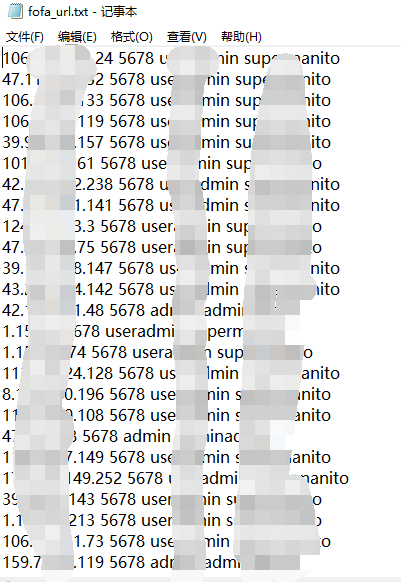
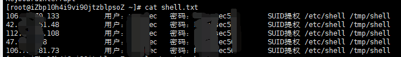

#### fofa.py
It is used to find all default username and password which use "JD薅羊毛" system.
- use: python fofa.py
and you can change some paramiter in file's config part.
- you can get file： 
  fofa_url.txt(succes ip and it's user,pass)
  fofa_logs.txt(logs with running)

#### getshell.py

> It’s written by 【opang】 and 【pikpik】, thanks for this guys !

`python getshell.py` can get useful tips


use fofa_url.txt to get thire shell

test ssh, if succesful connect , save in shell.txt

-----

needs to install this two python library

```
pip install requests
pip install paramiko
```

----

##### fofa_url.txt

##### 

##### fofa_logs.txt


##### shell.txt

##### 


## Have a nice day :P !