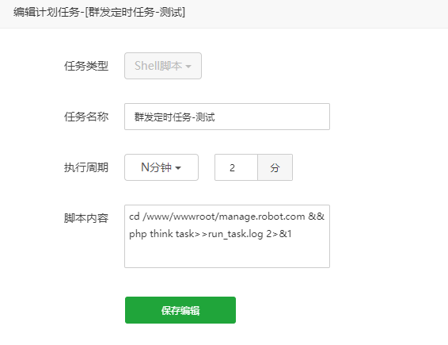
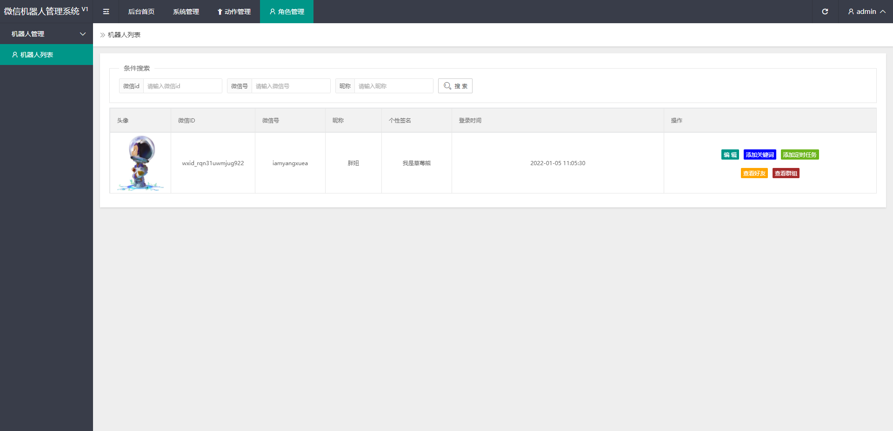
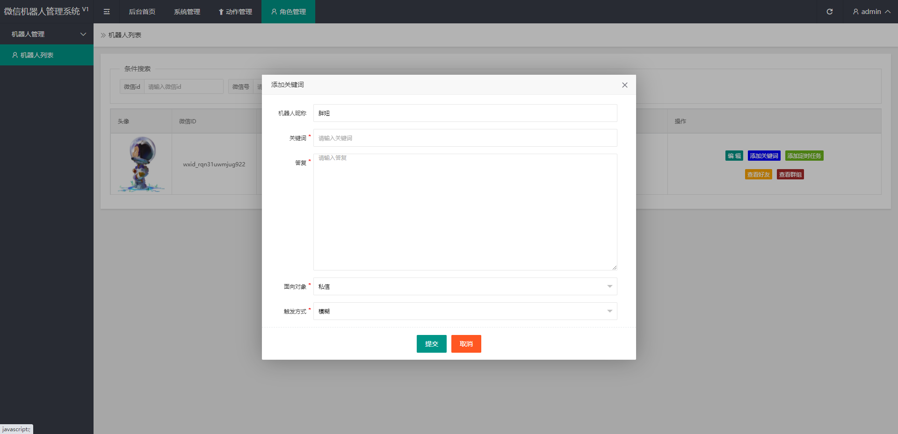
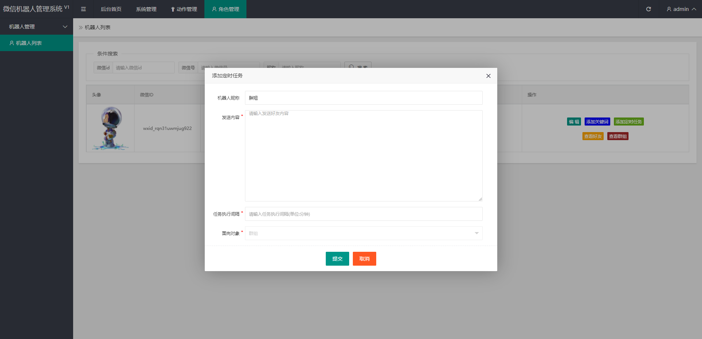
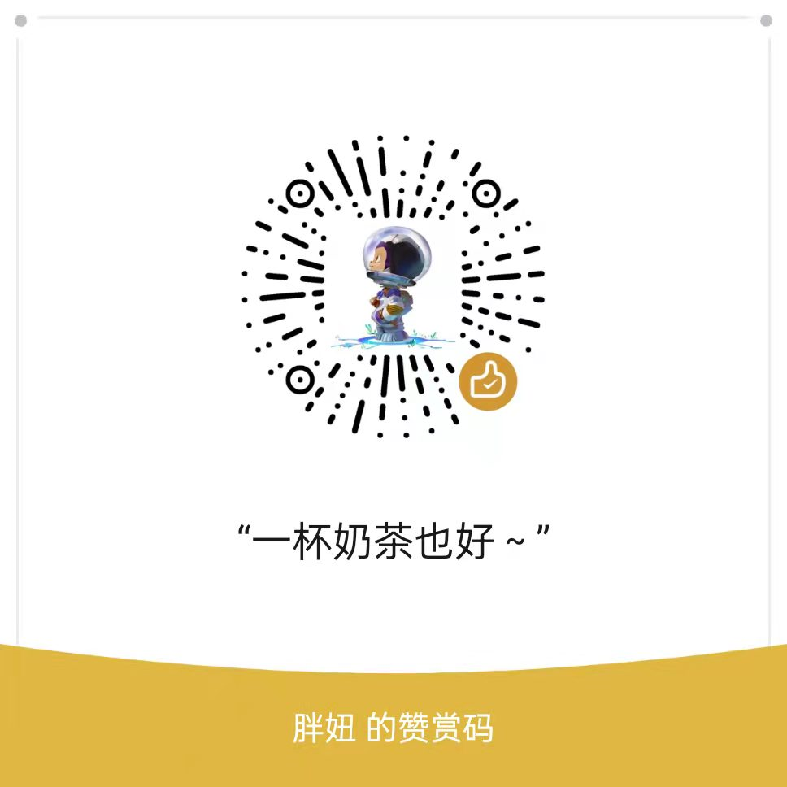

# Manage_WXRobot_Web
 一套管理微信机器人的web程序

因为身边有朋友、客户需要做可视化的管理微信机器人工具。所以我用tp5开发了一套...

对于不会写代码的同学，算是福音。

[只需要5分钟教你学会部署！](./部署文档.md)

## 特点

1.支持关键词（仅支持模糊触发）；

2.支持定时任务（目前仅可发送文字消息，可自行拓展）；

3.可设置服务群组（机器人只为指定的群组进行服务，防止打扰到其他群）；

4.可在线发送群组和私信消息（貌似也没什么大用）；

5.可修改群公告（好像也没什么大用）

...

## 搭建所需环境

1、thinkphp5.6及以上

2、mysql5.6及以上

3、linux和windows系统都可

## 定时任务

因需要监听定时群发消息，需要配置定时任务。

**宝塔可参考**

也可以写一个shell脚本，去定时监控存在的定时任务。

## 演示图

群组和好友，就不出演示图了。

有需要的朋友，可以下载后搭建使用。

需配合该http-sdk插件使用，可参考下方仓库。

https://github.com/xiaorui16888/Http_Sdk_For_Lovely_Cat

该插件原作者偶尔会更新，我只是把登录去掉了，也可以使用。

有想法的同学，也可以加我微信iamyangxuea，聊聊？

觉得有帮助的同学，可以给个star，一种鼓励~

