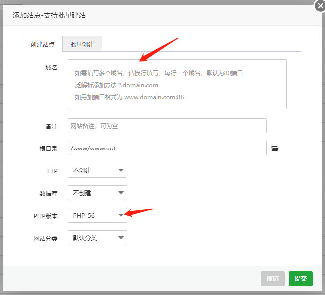
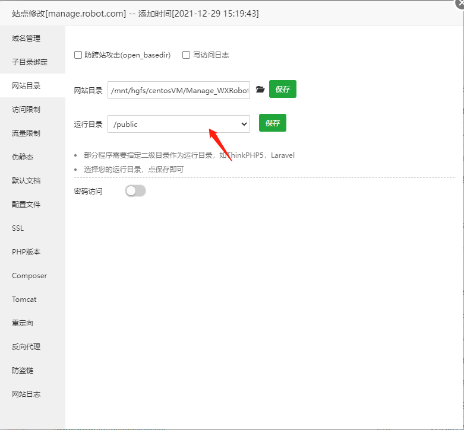
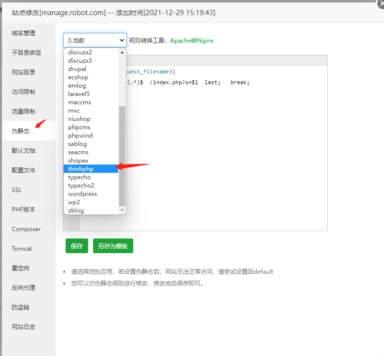
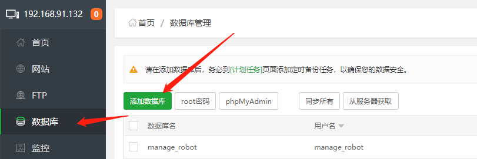
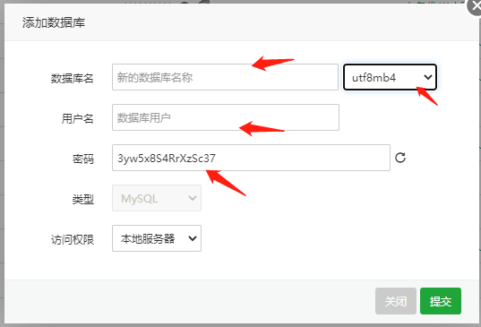
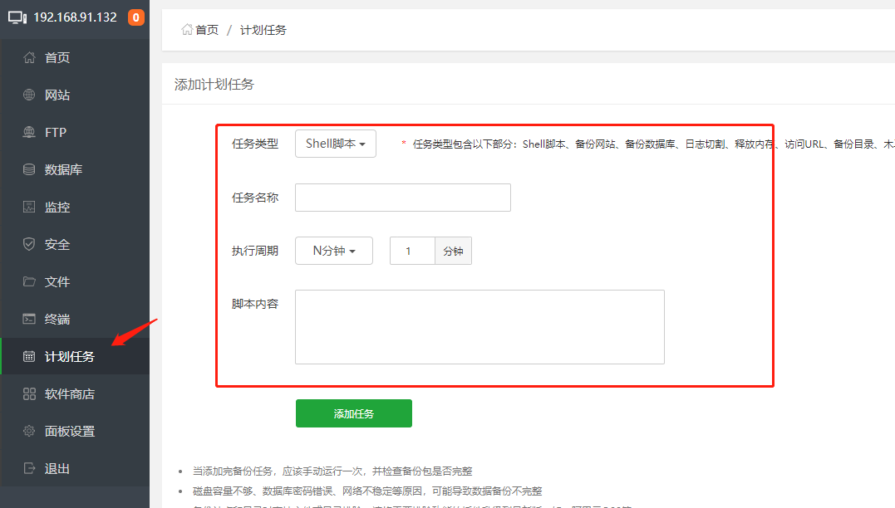

#  Manage WXRobot安装文档

因为本程序是一套web程序，所以你的服务器必须有一套支持web应用的环境。那我们就开始吧！

## 一、服务器：

centos7.2.x及以上（window系统也可以，方法都是一样）

其实我更推荐你用windows的服务器，因为**可爱猫**需要挂在windows的服务器上。你完全可以把本程序运行在windows服务器上。懂我意思吧？

## 二、安装宝塔。

```
为什么推荐宝塔呢？

一、可视化，易操作，适合小白搭建网站。

二、一键安装lnmp或lamp环境。
```

打开ssh终端，输入以下命令，安装宝塔。遇到`y` ，输入`y` 就行，就是同意。

```shell
yum install -y wget && wget -O install.sh http://download.bt.cn/install/install_6.0.sh && sh install.sh
```

安装完成后，会弹出宝塔的外网面板地址。复制到浏览器打开访问就行。

如果访问不了，在你买服务器的主机商-服务器-安全组放行即可。

## 三、安装web环境-lnmp

打开宝塔登录后，点击网站。

会自动弹出，安装web环境。


选中lnmp，也就是有nginx的那一列。安装即可。

## 四、部署本程序

点击`网站`-点击`添加站点`



域名：

①你可以去网上买一个域名，阿里云、腾讯云...（付费）

②你可以自定义一个域名，然后在host文件里面指定下。（免费）

③你可以直接输入`你的外网ip`，直接ip访问即可。

PHP：5.6-7.2，我亲测都兼容的。

其他的不用填写，点击`提交`。

下载`本程序源码`后，解压到你的**站点目录**下，怎么下载就不需要我教吧。



`运行目录`设置为`public`，保存；

`伪静态`选择为`thinkphp`，保存。



因为本程序是采用数据库和缓存，来记录`关键词`等这些数据的。所以需要用到数据库。

点击`数据库`-点击`添加数据库`，





数据库的编码记得改成`utf8mb4`，因为你存储表情如果用`utf8`，程序会异常。

如果你懒得在源码中修改数据库配置，可以在这里添加数据库的时候，输入以下。

如果你心里硌得慌...你可以在`config/database.php`文件中修改。

```
数据库名称：manage_robot
用户名：manage_robot
密码：5jkrAPzLFNziAXnN
```

到此，程序就可以正常运行了。

## 五、访问路径

管理后台地址：域名/admin

账号：admin

密码：123456.

## 六、定时任务的配置

点击`计划任务`，选择如下图；



`任务名称`，你随便起名，言简意赅，通俗易懂就行。

`脚本内容`，如下：

```shell
cd /www/wwwroot/manage.robot.com && php think task>>run_task.log 2>&1
```

如果你不想记录日志，如下：

```shell
cd /www/wwwroot/manage.robot.com && php think task
```

`/www/wwwroot/manage.robot.com`为程序的安装路径，替换为你自己的路径即可。

## 七、扩展

如果你想自定义一些定时任务，可参考以下文件

`application/command.php`  --- 指令

`application/command/Quan.php`  --- 定时任务处理函数

## 八、问题

你可能存在的问题？

①宝塔面板打不开？不会配置安全组？

答：如果你买的是阿里云、腾讯云等，可参考下方解决文档。

```
腾讯云：https://www.bt.cn/bbs/thread-1229-1-1.html  
阿里云：https://www.bt.cn/bbs/thread-2897-1-1.html
华为云：https://www.bt.cn/bbs/thread-3923-1-1.html
```

②这款程序能不能搭建到自己的电脑上？

答：当然可以。只要你觉得电费划算~

...等待补充...如果你还有什么问题，可以提issue

## 九、特惠服务器推荐

[阿里云超值云产品](https://www.aliyun.com/minisite/goods?userCode=qisrok9t&share_source=copy_link)

[【腾讯云】云产品限时秒杀，爆款2核4G云服务器首年74元](https://curl.qcloud.com/7dhNEHye)

## 十、结语

搭建的流程就这么简单~你觉得呢？有想法的小伙伴可以添加我！聊聊？


