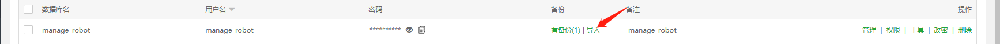
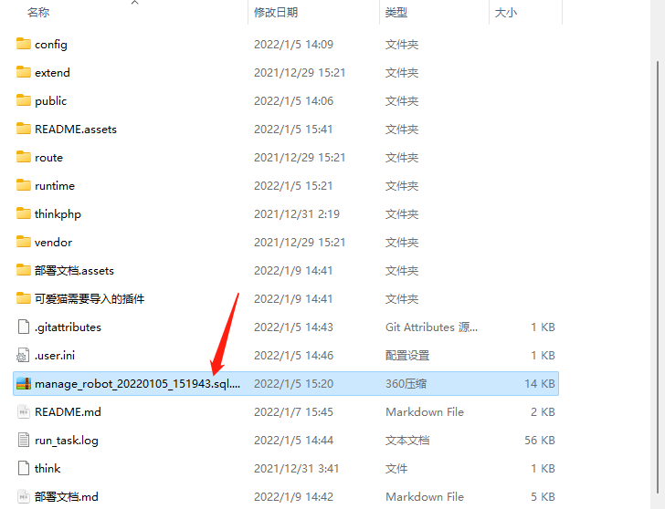
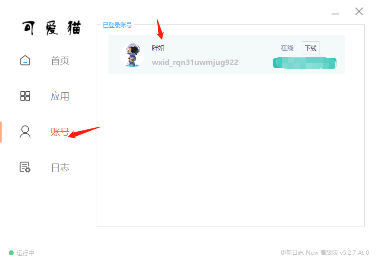
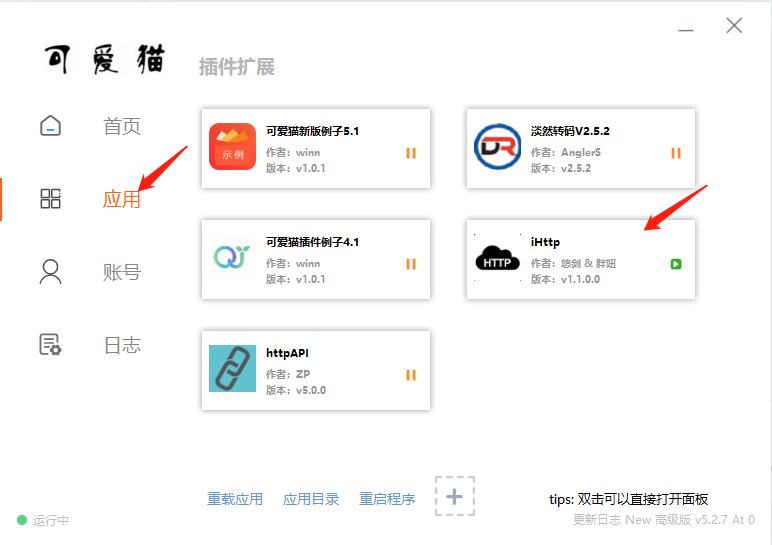
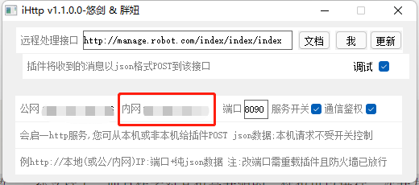
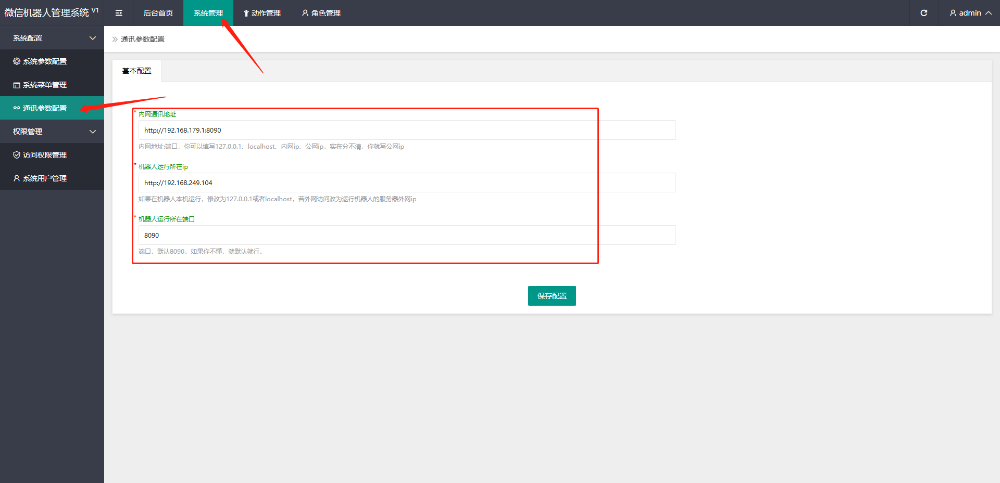

#  Manage WXRobot安装文档

因为本程序是一套web程序，所以你的服务器必须有一套支持web应用的环境。那我们就开始吧！

**工欲善其事必先利其器**，以下为环境中软件的版本要求。

①服务器，winserver2012R及以上或centos7.2及以上。

②数据库，mysql5.6及以上

③Nginx 1.18.0，宝塔默认的就是这个，别改动。

④php5.6及以上

以上为我亲测的版本，你可以选择更高的版本，若出现不兼容的情况...

## 一、服务器：

centos7.2.x及以上（window系统也可以，方法都是一样）

其实我更推荐你用windows的服务器，因为**可爱猫**需要挂在windows的服务器上。你完全可以把本程序运行在windows服务器上。懂我意思吧？

## 二、安装宝塔。

```
为什么推荐宝塔呢？

一、可视化，易操作，适合小白搭建网站。

二、一键安装lnmp或lamp环境。
```

### linux-centos7.2安装方式

打开ssh终端，输入以下命令，安装宝塔。遇到`y` ，输入`y` 就行，就是同意。

```shell
yum install -y wget && wget -O install.sh http://download.bt.cn/install/install_6.0.sh && sh install.sh
```

### windows安装方式

浏览器打开，下载后，`下一步`安装即可

https://www.bt.cn/download/windows.html

安装完成后，会弹出宝塔的外网面板地址。复制到浏览器打开访问就行。

如果访问不了，在你买服务器的主机商-服务器-安全组放行即可。

## 三、安装web环境-lnmp

打开宝塔登录后，点击网站。

会自动弹出，安装web环境。


选中lnmp，也就是有nginx的那一列。安装即可。

## 四、部署本程序

点击`网站`-点击`添加站点`


域名：

①你可以去网上买一个域名，阿里云、腾讯云...（付费）

②你可以自定义一个域名，然后在host文件里面指定下。（免费）

③你可以直接输入`你的外网ip`，直接ip访问即可。

PHP：5.6-7.2，我亲测都兼容的。

其他的不用填写，点击`提交`。

下载`本程序源码`后，解压到你的**站点目录**下，怎么下载就不需要我教吧。


`运行目录`设置为`public`，保存；

`伪静态`选择为`thinkphp`，保存。


因为本程序是采用数据库和缓存，来记录`关键词`等这些数据的。所以需要用到数据库。

点击`数据库`-点击`添加数据库`，


数据库的编码记得改成`utf8mb4`，因为你存储表情如果用`utf8`，程序会异常。

如果你懒得在源码中修改数据库配置，可以在这里添加数据库的时候，输入以下。

如果你心里硌得慌...你可以在`config/database.php`文件中修改。

```
数据库名称：manage_robot
用户名：manage_robot
密码：5jkrAPzLFNziAXnN
```

然后点击`提交`。提交完后，点击`导入`。



点击`从本地上传`，选择本程序中数据库。导入即可。



到此，`在线管理程序`就可以正常运行了。

## 五、启动机器人&配置http插件

但是大家有么有忘记这个程序是做什么的呢？---管理你的微信机器人的啊！所以打开你的可爱猫，登录你的微信账号。

如果你没有下载可爱猫，本仓库中有，就在根目录下，名字叫`可爱猫5.1.7`



登录后，如上图。然后点击应用。



双击打开`iHttp`插件。

```
这个插件适合小白学习入门使用。基本上所有的事件函数...都支持了。而且作者对其也是开源的。你也可以进行二次开发。挺不错的推荐！
```

切入正题，打开插件后，如下图。



这里的`内网`，你假装在心里记一下。其实不用记，待会你切换下窗口，复制下就行~

`端口`，如果你是个小白，那你尽量别改。默认就行~

`远程处理接口`，待会再说。

## 六、打开后台管理系统--访问路径

管理后台地址：域名/admin

账号：admin

密码：123456.

登录后，打开此窗口，如下图



看到这里，你是否想起上一步的***,那些配置信息。

`内网通讯`，你就填写你的`ihttp`插件中的内网ip就行。（如果你懂得多，怎么写，你看着整就行）

`机器人运行的所在ip`，你就填写你服务器公（外）网ip就行。（如果你懂得多，你看着写）

`机器人运行的端口`，你就填写8090就行。（如果你懂得多，你改个端口也行。）

这里的配置信息，你不懂的话，就按照上述操作。实现看不懂的话，可以加我微信，我来教你。因为最近很多人都卡到这里，不知道怎么填写，很正常！对于第一次接触的朋友，都可以理解，哈哈

切入正题！

## 七、定时任务的配置

点击`计划任务`，选择如下图；


`任务名称`，你随便起名，言简意赅，通俗易懂就行。

`脚本内容`，如下：

```shell
cd /www/wwwroot/manage.robot.com && php think task>>run_task.log 2>&1
```

如果你不想记录日志，如下：

```shell
cd /www/wwwroot/manage.robot.com && php think task
```

`/www/wwwroot/manage.robot.com`为程序的安装路径，替换为你自己的路径即可。

## 八、扩展

如果你想自定义一些定时任务，可参考以下文件

`application/command.php`  --- 指令

`application/command/Quan.php`  --- 定时任务处理函数

## 九、问题

你可能存在的问题？

①宝塔面板打不开？不会配置安全组？

答：如果你买的是阿里云、腾讯云等，可参考下方解决文档。

```
腾讯云：https://www.bt.cn/bbs/thread-1229-1-1.html  
阿里云：https://www.bt.cn/bbs/thread-2897-1-1.html
华为云：https://www.bt.cn/bbs/thread-3923-1-1.html
```

②这款程序能不能搭建到自己的电脑上？

答：当然可以。只要你觉得电费划算~

③你可能看到程序中，有一些功能点击后，没有作用？

答：因为我还没来得及实现这些功能。如果你有想法，可以用勤劳的双手和智慧的大脑去实现。可以提交pr，求之不得，哈哈。

④如果你这个程序更新了，我该怎么操作才能更新呢？

答：你可以选择`pull`，但是务必不要覆盖`根目录`下的`runtime`文件夹。这里面有你的缓存（关键词等）。如果你不会git的操作，你可以直接重新下载。然后覆盖进去就行了，但是务必别覆盖`runtime`文件夹。

⑤ihttp插件是否可以更新？

答：你可以选择更新，也可以不更新。我建议是不更新，因为更新后，可能会发生不兼容的情况。如果你善于折腾，你可以选择更新。因为更新后，可能插件的作者可能会支持新的事件接口。

...等待补充...如果你还有什么问题，可以提issue

## 十、特惠服务器推荐

[阿里云超值云产品](https://www.aliyun.com/minisite/goods?userCode=qisrok9t&share_source=copy_link)

[【腾讯云】云产品限时秒杀，爆款2核4G云服务器首年74元](https://curl.qcloud.com/7dhNEHye)

## 十一、鸣谢

感谢`ihttp`插件的开发者-[遗忘悠剑](https://gitee.com/ikam/http-sdk)

本程序中，通过http协议与可爱猫主程序进行通讯，全部基于本插件。如果有想法的同学，也可以对插件进行二次开发。

## 十二、结语

搭建的流程就这么简单~你觉得呢？有想法的小伙伴可以添加我！聊聊？


